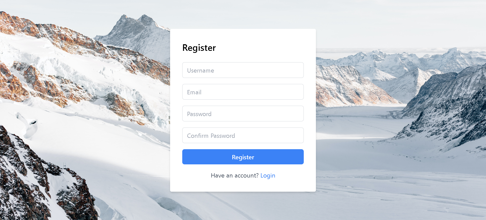
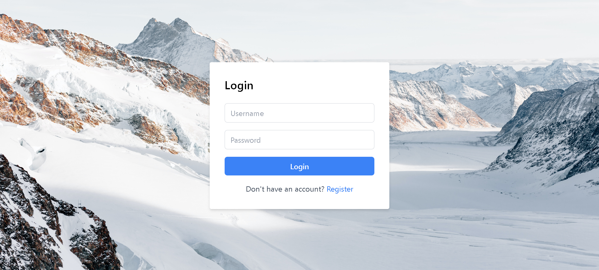
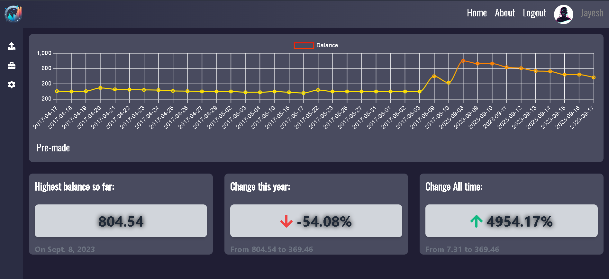
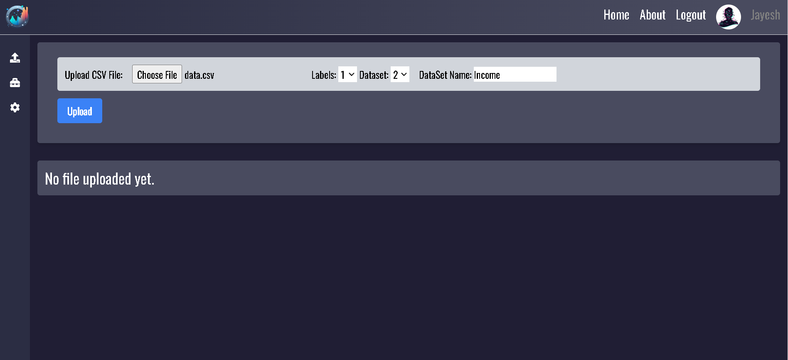
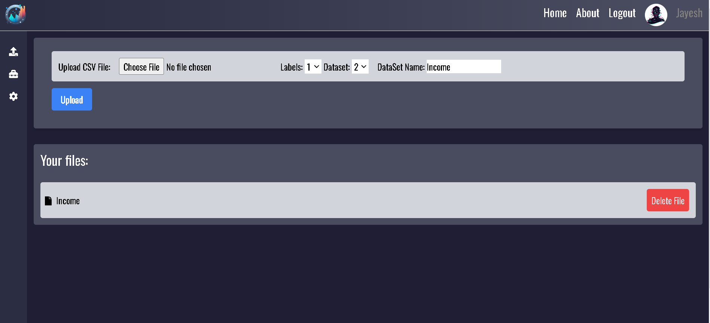
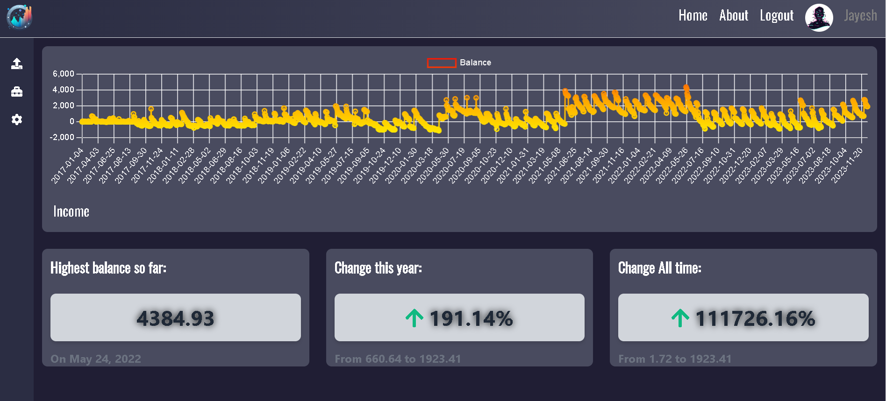

# Data Visualizer

This Django project, named **Data Visualizer**, aims to provide a platform for data visualization and analytics. Leveraging Django's capabilities, it offers functionalities for user authentication, data management, and visualization.

## Preview

**Register**


#### Login


**Pre built index**


**Upload**


**After upload**


**User given csv index**


## Installation

To set up this project locally, follow these steps:

1. Clone the repository:
   ```bash
   git clone https://github.com/JayeshNarkar/Data-Visualizer
   ```
2. Install dependencies:
   ```bash
   pip install -r requirements.txt
   ```
3. Apply database migrations:
   ```bash
   python manage.py makemigrations
   ```
4. Apply database migrations:
   ```bash
   python manage.py migrate
   ```

## Usage

1. Start the development server:
   ```bash
   python manage.py runserver
   ```
2. Access the application in a web browser at `http://127.0.0.1:8000/`

## Features

### User Authentication

- **Login:** Allows users to log in with their credentials.
- **Logout:** Logs out the currently logged-in user.
- **Registration:** Enables new users to create accounts.

### Data Management

- **Index View:** Displays visualizations and analytics based on uploaded data.
- **Upload View:** Facilitates the upload of data files for analysis.

### Utilities

- **Layout View:** Provides user information in JSON format.
- **DeleteFileView:** Removes uploaded files.

## Contributing

1. Fork the repository.
2. Create a new branch for your feature: `git checkout -b feature-name`
3. Make changes and commit: `git commit -m 'Add feature'`
4. Push to the branch: `git push origin feature-name`
5. Submit a pull request.

## Todo
- [ ]  implement User profile
- [ ]  implement Add to csv file feature
- [ ]  Fix changing csv files but Data frame not being changed

## License

Django is distributed under the BSD license. Please see the LICENSE-Django file for details.

Pandas is distributed under the BSD 3-Clause License. Please see the LICENSE-Pandas file for details.

---

